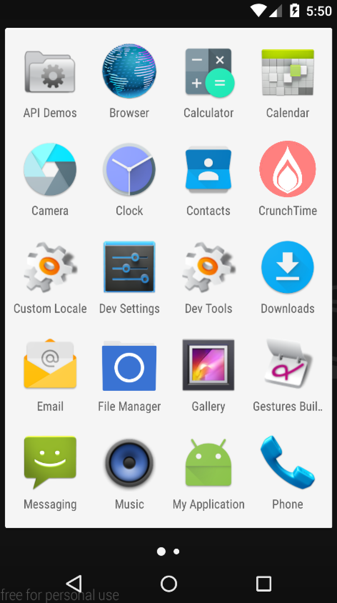
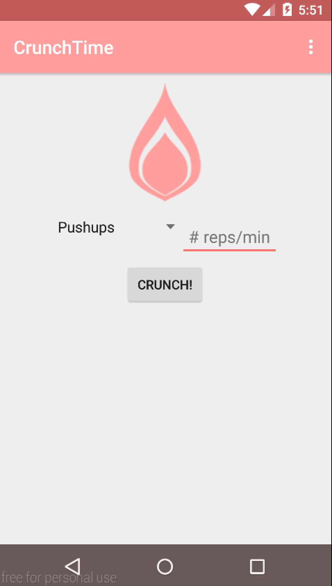
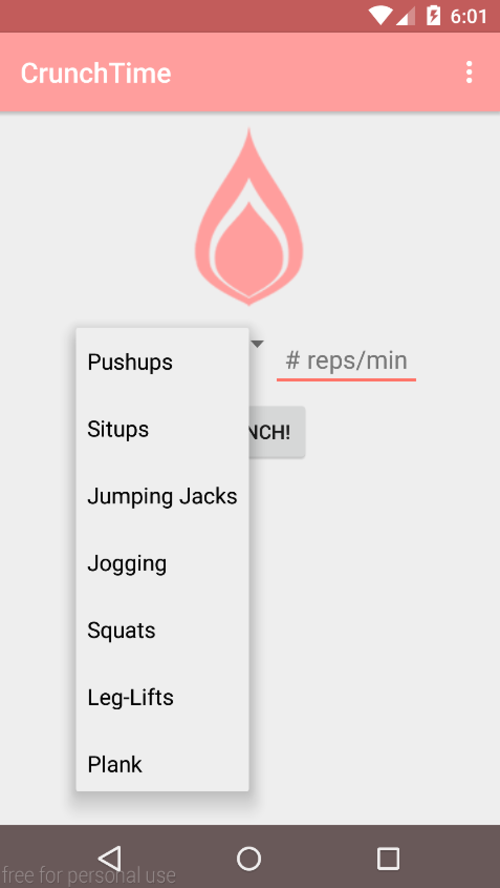
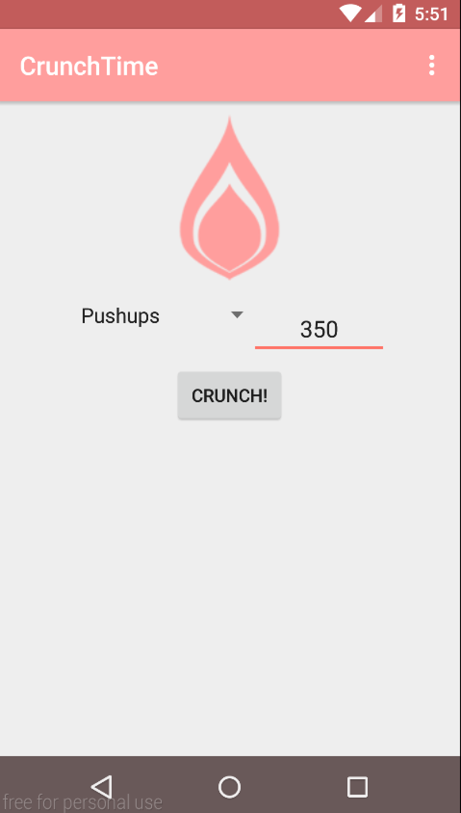
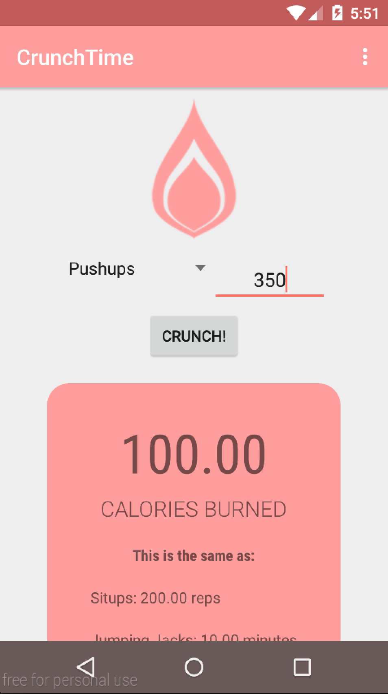
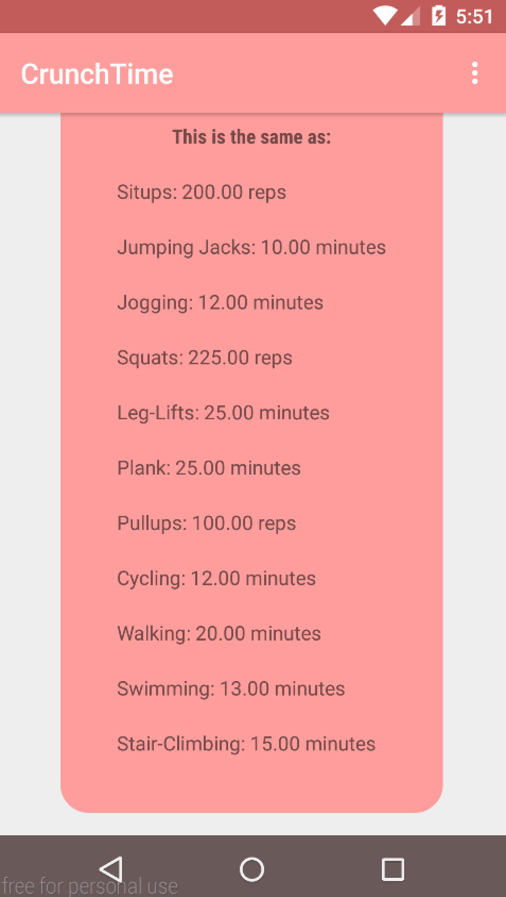
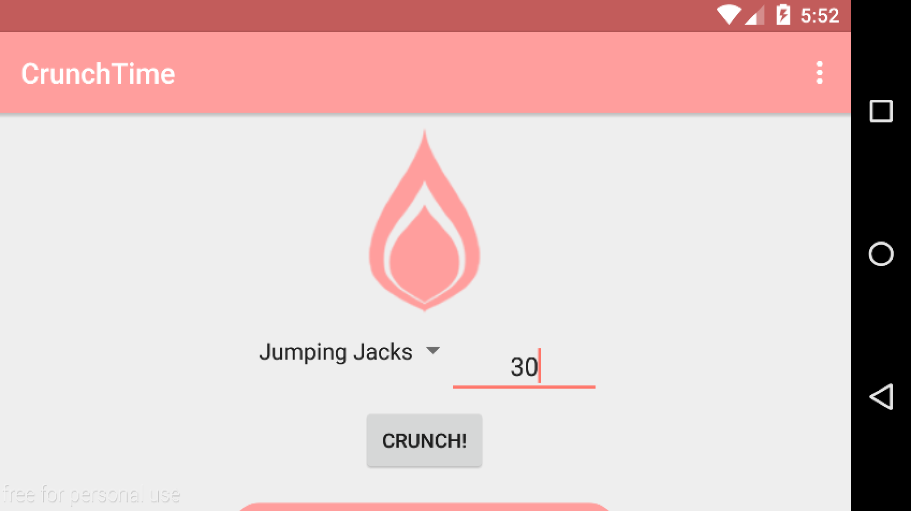
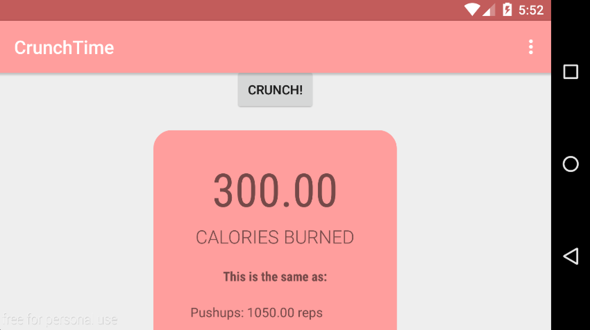

# PROG 01: CrunchTime

CrunchTime is a simple Android app that allows users to see how many Calories they've burned after doing a certain amount of exercise.
The conversion is most accurate for those around 150lbs. 

## How to Use:

To open the app, users should click on the pink CrunchTime icon. Simply type in the number of reps/minutes for which you've performed a certain exercise and the app will display not only the number of Calories you have burned, but how many reps/minutes of other types of exercises you could have done to burn the same number of kCals. Note that the application will not reset itself, so the next time you open it, you can see how many kCals you burned previously.

Each exercise has certain units that must be adhered to. 

Exercises that must be given in reps:
* Pushups
* Situps
* Squats
* Pullups

Exercises that must be given in minutes:
* Leg-lifts
* Plank
* Jumping Jacks
* Cycling
* Walking
* Jogging
* Swimming
* Stair-Climbing

## Authors

Michelle Chang ([michang@berkeley.edu](mailto:michang@berkeley.edu))

## Demo Video

See [your demo video title here] (https://link_to_your_video)

## Screenshots

## Acknowledgments

* The flame icon was modified courtesy of Edward Boatman from the Noun Project!
